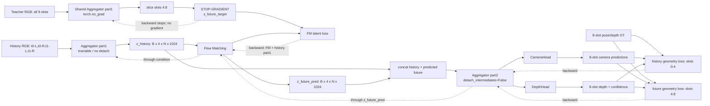

# VGGT-World 未来 3D Latent 联合微调：对话与修改记录

> 记录日期：2026-07-13  
> 项目路径：`/Users/ZS5LCA9/Desktop/WAM（drive）/code/VGGT-World`  
> 文档性质：这是本次完整对话的结构化记忆，不是逐字聊天转录。所有关键问题、结论、设计决策、代码改动和未验证项均在文档中保留。

## 1. 最终目标

当前阶段只微调 VGGT-World，不接 action head。目标是：

1. 使用大量含 3D/深度监督的时序数据集微调预训练 VGGT-World。
2. 输入当前/历史 RGB 观测，预测未来 VGGT 3D latent。
3. 要求未来 latent 保留可解码的深度和几何信息，而不只是 latent MSE 上相似。
4. 该阶段完成后冻结整个 VGGT-World 分支。
5. 后续再将其未来 3D latent 输入 baseline action head，只微调 action head，测试 3D 未来想象是否提高动作执行精度。

当前具体序列是：历史 `2 时间步 x 双目 = 4 图` 预测未来 `2 时间步 x 双目 = 4 图`。

本次代码只实现第 1–3 点，没有修改或接入 action head。

## 2. 对原 VGGT-World 训练的理解

### 2.1 原有主路径

原 Stage-1 FM 训练主要是：

```text
历史 RGB (2 帧)
  -> Aggregator.part1
  -> history latent

历史 + 未来 RGB (4 帧)
  -> Aggregator.part1
  -> 取未来 2 帧 target latent

history latent + future target latent
  -> Flow Matching
  -> FM latent loss
```

原 `Trainer._step()` 只使用模型返回的 FM loss，没有调用配置中虽然保留了的 `MultitaskLoss`。

### 2.2 原训练有没有 Depth 监督

对原 FM-only 训练路径而言，没有激活的 depth loss。

- 虽然模型包含预训练 VGGT `depth_head`。
- 虽然 YAML 中保留了 camera/depth/point loss 配置。
- 但 Stage-1 `Trainer._step()` 没有将 head 输出送入 `MultitaskLoss`。
- 原配置还冻结了 aggregator、camera/depth/point/track heads，实际主要训练 FM。

因此，原有 depth 能力主要来自预训练 VGGT 几何空间和冻结 depth decoder，而不是 VGGT-World FM 训练期间的 depth 监督。

### 2.3 为什么原代码可以冻结 Aggregator 和 Depth Head

原方案的隐含假设是：

1. 预训练 VGGT 已建立一个可被 `part2 + geometry heads` 解码的 latent 空间。
2. FM 只需要学会在该固定 latent 空间中预测未来。
3. 冻结 backbone/head 能降低训练显存和破坏原几何能力的风险。

但如果 FM 预测 latent 只在 latent loss 上接近 target，不保证经过 depth head 后的深度一定准确。这正是本次方案增加几何监督的原因。

### 2.4 KITTI 与原 VGGT 的关系

当前仓库中的 `default_kitti.yaml` 是 VGGT-World/FM 的 KITTI 时序训练配置。它不能单独证明原始 VGGT 预训练时是否使用过 KITTI。本次修改依赖的是预训练 VGGT 权重及其几何 heads，以及 VGGT-World 已训练 FM checkpoint。

## 3. 对话中讨论过的训练方案

### 3.1 单阶段联合训练（最终选择）

```text
历史 RGB -> part1 -> history latent ----------------------+
                                                             |
历史+未来 RGB -> part1 -> future target latent --+--> FM latent loss
                                (target detach)               |
                                                             +--> FM -> predicted future latent

concat(history latent, predicted future latent)
  -> part2
  -> camera/depth/(optional point) heads
  -> 历史+未来几何监督
```

优点：

- 直接对最终要使用的 FM future latent 施加几何约束。
- 同时微调 history `part1`、FM、`part2` 和已启用 heads。
- 训练流程与未来真正用法一致：只给历史 RGB，由 FM 产生未来 latent。

### 3.2 讨论过的另一种单阶段方案

历史和未来 RGB 都经过 `part1 -> part2 -> geometry heads`，使用真实观测的几何 loss 微调 VGGT；同时，历史 `part1` latent 输入 FM，用未来 `part1` latent 监督 FM。

该方案能保证 VGGT 几何分支从真实 RGB 学习，但 FM 预测 latent 本身不一定直接受到 depth/geometry loss。对“预测 latent 必须含深度”这一目标，最终选择的方案更直接。

### 3.3 两阶段保底方案

1. 第一阶段：用真实 3D/depth/camera 监督微调 aggregator、`part2` 和几何 heads，重新校准新数据域的几何能力。
2. 第二阶段：冻结校准后的 VGGT backbone/heads，再仿照原 VGGT-World 训练 FM。

适用场景：单阶段联合训练不稳定、几何 head 与新数据域偏差较大，或 FM 与 backbone 互相拉扯时。

## 4. 最终实现的网络框架

### 4.1 数据流

```text
images: [B, 8, 3, H, W]
slot order:
[t0-L, t0-R, t1-L, t1-R | t2-L, t2-R, t3-L, t3-R]

history_images = images[:, 0:4]  # 2 时间步 x 双目
future_images  = images[:, 4:8]  # 2 时间步 x 双目

history_images
  -> Aggregator.part1 (trainable, no detach)
  -> z_history: [B, 4, N, 1024]

images[:, 0:8]
  -> Aggregator.part1 (torch.no_grad in joint mode)
  -> slice image slots 4:8
  -> z_future_target: [B, 4, N, 1024]

noise + z_future_target + condition=z_history
  -> FM training forward
  -> L_FM
  -> z_future_pred: [B, 4, N, 1024], differentiable

concat(z_history, z_future_pred, dim=1)
  -> z_combined: [B, 8, N, 1024]
  -> Aggregator.part2(detach_intermediates=False)
  -> 4 层 DPT features: each [B, 8, N, 2048]
  -> CameraHead / DepthHead / optional PointHead
```

### 4.2 系统框架与梯度截断图



图中唯一主动截断的 teacher 路径是 `z_future_target`。`z_history -> FM`、`z_history -> part2`、`z_future_pred -> part2` 以及 part2 的中间特征均保持可微。CameraHead 内部在下一次 pose refinement 前对上一次 pose 估计的 detach 是原 VGGT 设计，不会截断每个阶段的 camera loss 到 CameraHead/part2 的直接梯度。

### 4.3 当前输出

- Camera：`pose_enc_list`，默认 4 次迭代，每次 `[B, 8, 9]`。
- Depth：`depth [B, 8, H, W, 1]` 和 `depth_conf [B, 8, H, W]`。
- Point：代码路径已复用，但当前 joint 配置关闭。
- Track：当前联合路径关闭。

### 4.4 复用的现有解码路径

项目原来已有以下路径，不需要新写 decoder：

```text
latent -> model.aggregator.part2([latent]) -> depth_head / point_head / camera_head
```

可参考：

- `demo/kitti_demo.py`
- `eval/kitti_val_short.py`
- `eval/kitti_val_mid.py`
- `training_fm/trainer.py` 原有 validation dump 路径

本次修改将这条原有推理路径封装为可微训练路径，没有从头实现 depth/point decoder。

## 5. Detach 与梯度路径

### 5.1 最终选择：情况一

只 detach 未来 target：

```text
future RGB -> target part1 -> future target latent
                                X  no direct gradient
```

代码使用：

```python
with torch.no_grad():
    target_stage_list, _ = self.aggregator.part1(images)
```

`torch.no_grad()` 与在输出上调用 `.detach()` 的反向语义一致，但不保留该分支无用的计算图，更节省显存。

### 5.2 FM Latent Loss 的梯度

```text
L_FM
  -> FM parameters
  -> history condition latent
  -> history part1
```

不更新未来 target 那次 `part1` 的计算图。

### 5.3 几何 Loss 的梯度

```text
L_geometry
  -> enabled geometry heads
  -> Aggregator.part2
  -> predicted future latent
  -> FM
  -> history latent
  -> history part1
```

同时，history geometry 预测也通过真实 `z_history` 直接更新 history `part1`。由于 `part2` 有跨帧 global attention，即使是 history geometry loss，也可能经未来预测 token 路径更新 FM。

### 5.4 为什么“FM 两端都 detach”不适合当前方案

如果 history condition 也 detach：

- FM latent loss 无法更新 history `part1`。
- geometry loss 通过 FM condition 的路径也无法更新 history `part1`。
- 只剩 `part2` 中 history latent 的直接路径可能更新 history `part1`，与“FM 与几何共同校准 history encoder”的目标不一致。

因此最终只 detach future target。

### 5.5 共享 Aggregator 参数的细节

history `part1` 和 future target `part1` 调用的是同一套 aggregator 参数。future target 分支虽然没有直接梯度，但 aggregator 会被 history/part2 路径更新，所以下一个 step 重新编码的 future target 也会间接变化。

## 6. Part2 内部 Detach 问题

### 6.1 原代码的行为

`Aggregator.part2()` 在提取 block 4/11/17/23 的 DPT 中间特征时，原来对部分特征调用 `.detach()`。

- block 4：输入 latent 保留梯度，global feature detach。
- block 11/17/23：frame/global feature 都 detach。

这符合原有冻结/推理/节省计算图的使用场景，但不符合当前联合几何微调。

### 6.2 本次修改

`part2()` 新增：

```python
detach_intermediates: bool = True
```

- `True`：保持旧路径的兼容行为。
- `False`：不 detach part2 中间特征，保留完整几何反向路径。

联合训练调用：

```python
self.aggregator.part2(
    [latent_sequence],
    patch_hw=patch_hw,
    detach_intermediates=False,
)
```

当前框架中 `part2` 实际不截断梯度。唯一有意截断的仍是 future target 分支。

## 7. FM 返回可微 Clean Future Latent

### 7.1 为什么不能直接用 `sample_euler()` 训练几何 Loss

`sample_euler()` 有 `@torch.no_grad()`，完整 Euler 采样得到的 latent 不能将 depth/geometry loss 回传到 FM。多步采样全部展开反向也会显著增加显存和计算。

### 7.2 训练期间的 Clean Latent

FM loss 在随机时间步构造：

```text
x0: random noise
x1: detached future target latent
xt = sigma * x0 + (1 - sigma) * x1
```

FM forward 输出对无噪未来 latent 的估计：

```text
x1_pred = FM(xt, history_condition, timestep)
```

本次将 `x1_pred` 保留为可微张量，并在联合模式返回：

```python
if return_x1_pred:
    return fm_loss, x1_pred
```

它是“随机噪声时间步下对 clean x1 的预测”，不是 GT，也不是完整 Euler 采样的最终结果。推理时仍然使用 `sample_euler()`。

## 8. 原 FM Loss 只监督第一张未来帧的问题

张量语义：

```text
x1_layers[0]: [B, T, N, C]
T = future image-slot count（当前双目配置为 4）
len(x1_layers) = 1 latent level
```

原代码将 `[B, T*N, C]` 按帧 split 成长度 `T=2` 的列表，却使用：

```python
for i in range(len(x1_layers)):
```

由于 `len(x1_layers)==1`，循环只取 `i=0`，第二张未来帧没有进入 FM loss。问题来自混淆了“latent 层数”与“未来帧数”。

修复为：

```python
loss = F.mse_loss(v_hat_big, v_star_big)
```

直接在 `[B, T*N, C]` 上对所有未来帧和所有 token 计算 MSE。

## 9. MultitaskLoss 与最终 Loss 公式

### 9.1 配置权重

| 项目 | 当前数值 |
|---|---:|
| `fm_weight` | 1.0 |
| `geometry_weight` | 1.0 |
| `history_weight` | 1.0 |
| `future_weight` | 1.0 |
| camera task weight | 5.0 |
| depth task weight | 1.0 |
| point task weight | 0（关闭） |
| track task weight | 0（关闭） |

### 9.2 历史/未来分开监督

`MultitaskLoss` 先沿时间维将 prediction 和 GT batch 同步切为 history/future，再独立归一化计算两个时间段的几何 loss。

```text
L_geometry
  = 1.0 * L_geometry_history
  + 1.0 * L_geometry_future
```

两者是相加，不是再除以 2。

### 9.3 Camera Loss

```text
L_camera = L_T + L_R + 0.5 * L_FL
```

- `L_T`：平移。
- `L_R`：四元数旋转。
- `L_FL`：焦距/FOV。

进入 geometry objective 后乘以 camera task weight `5.0`：

```text
5 * L_camera = 5 * L_T + 5 * L_R + 2.5 * L_FL
```

### 9.4 Depth Loss

```text
L_depth
  = L_conf_depth
  + L_reg_depth
  + L_grad_depth
```

depth task weight 为 `1.0`，三个子项当前没有额外独立系数。置信度回归内部默认 `gamma=1.0`、`alpha=0.2`，空间梯度项使用 `gradient_loss_fn="grad"`。

### 9.5 Point Loss（当前关闭）

如果开启：

```text
L_point
  = L_conf_point
  + L_reg_point
  + L_grad_point
```

当前配置为 `enable_point: false` 且 `loss.point: null`，所以有效系数为 0。

### 9.6 当前总 Loss

对 `s in {history, future}`：

```text
L_geo^s
  = 5 * (L_T^s + L_R^s + 0.5 * L_FL^s)
  + L_conf_depth^s
  + L_reg_depth^s
  + L_grad_depth^s
```

最终：

```text
L_total
  = L_FM
  + L_geo_history
  + L_geo_future
```

完全展开：

```text
L_total = L_FM
        + 5*L_T_history + 5*L_R_history + 2.5*L_FL_history
        + L_conf_depth_history + L_reg_depth_history + L_grad_depth_history
        + 5*L_T_future + 5*L_R_future + 2.5*L_FL_future
        + L_conf_depth_future + L_reg_depth_future + L_grad_depth_future
```

## 10. Camera Head 的 4 次迭代和阶段权重

### 10.1 这是不是源代码设计

是。`vggt/heads/camera_head.py` 在仓库初始版本中就定义：

```python
def forward(..., num_iterations: int = 4):
```

它不是本次联合微调新增的。

### 10.2 4 次迭代不是 4 帧

每次迭代都为全部 `S` 帧输出 `[B,S,9]` 位姿。4 次结果是一粗到细的位姿修正序列，不是分别对应 4 张图像。

```text
P1 = initial estimate
P2 = P1 + delta_2
P3 = P2 + delta_3
P4 = P3 + delta_4
```

4 次迭代共享同一套 Camera Head 参数。推理最终使用 `pose_enc_list[-1]`。

上一次 `pred_pose_enc` 在下一次使用前 detach，避免完整 BPTT，减少显存并提高稳定性。四个输出都有直接 camera loss，所以共享参数仍会收到来自各阶段的梯度。

### 10.3 `gamma=0.6` 的意义

4 次迭代的原始权重：

| stage | weight |
|---:|---:|
| 1 | `0.6^3 = 0.216` |
| 2 | `0.6^2 = 0.360` |
| 3 | `0.6^1 = 0.600` |
| 4 | `0.6^0 = 1.000` |

代码再除以 `n_stages=4`，所以对某一 camera 分量 `Q`：

```text
L_Q = (0.216*L_Q_1 + 0.36*L_Q_2 + 0.6*L_Q_3 + 1.0*L_Q_4) / 4
```

这不是 history/future 的时间权重，而是 Camera Head refinement stage 的权重。后期迭代更接近最终推理输出，所以权重更大；早期迭代仍接受辅助监督。

### 10.4 为什么 Camera Task Weight 是 5

`weight: 5.0` 是原 VGGT-World 多任务配置中已存在的人工权重，本次只保留，代码中没有证明它是理论最优值的注释或 ablation。它通常用于平衡 camera 参数 loss 与像素级 depth loss 的数值/梯度量级。

更重要的是，原 FM-only `Trainer._step()` 没有激活 `MultitaskLoss`，因此 `5.0` 在原 FM-only 训练中并未实际优化这个联合目标。在新方案中它只能作为初始起点，应根据以下量继续调整：

```text
L_FM
5 * L_camera
L_depth
各模块 gradient norm
```

## 11. Point Loss 为什么当前是 0

不是因为 KITTI 完全没有 3D point。KITTI 有 Velodyne LiDAR，但当前 Point Loss 需要的是与图像像素对齐、且在统一坐标系中的：

```text
world_points: [B,S,H,W,3]
point_masks:  [B,S,H,W]
```

原始 LiDAR 通常是稀疏 `[N,3]`/`[N,4]` 点集，需要 dataloader 进行：

```text
LiDAR/depth
  -> 投影或反投影到像素
  -> camera-space point map
  -> 根据 extrinsics 转到统一 world/reference 坐标系
  -> world_points + point_masks
```

最初的 KITTI 配置无法确认 loader 是否返回完整 `world_points`，因此为避免缺 GT 和 DDP unused parameter 错误，保守设置为：

```yaml
model:
  enable_point: false
loss:
  point: null
```

当前新增的 VKITTI adapter 已从 dense depth、K、pose 生成坐标系一致的 `world_points`。首轮仍暂时关闭 point loss，以先验证 FM+camera+depth；验证一个真实 batch 后，可以同时开启 point head/loss，并将 `point_head` 加入 `gradient_clip.configs`。

## 12. 代码修改清单

### 12.1 `vggt/models/vggt.py`

- 新增 `enable_fm_geometry_supervision`、`fm_history_frames`、`fm_future_frames`、`fm_views_per_timestep`。
- 保留旧 `*_frames` 字段名兼容 checkpoint，但多目模式下其语义是“图像槽位数”。
- 新增 `_validate_fm_sequence_layout()`，校验等长 4->4 及每时间步 2 视角的整除关系。
- 新增 `_get_patch_hw()`，正确处理矩形 patch 网格。
- 新增 `_decode_latent_sequence()`，复用 `part2 + camera/depth/point heads`。
- history `part1` 保持可微。
- joint mode 下只对 future target `part1` 使用 `torch.no_grad()`。
- 从 FM loss forward 获得可微 `pred_future_z`。
- `concat(history_z, pred_future_z) -> part2 -> geometry heads`。
- 关闭 joint mode 时保持原 FM-only 二元返回接口。
- 开启 joint mode 时返回 `(fm_loss, fm_loss_dict, geometry_predictions)`。

### 12.2 `vggt/models/aggregator.py`

- `part2()` 新增 `detach_intermediates` 开关。
- 默认 `True` 保持旧路径兼容。
- joint training 显式传 `False`，使几何梯度穿过 block 4/11/17/23。

### 12.3 `vggt/models/fm.py`

- `loss_rectified_multilayer(..., return_x1_pred=False)` 可选返回 clean future latent。
- 用 `reshape` 兼容非连续时间切片。
- 保留 FM forward 的可微 `x1_pred_big`。
- 修复原 loss 只使用第一张未来帧的错误。
- FM RoPE 使用 `views_per_timestep=2` 将 8 个时间主序槽位编为 `[0,0.5,1,1.5 | 2,2.5,3,3.5]`；patch token 和 special token 的 ID 保持一致。
- 这个双目位置改动没有新增可学参数，`views_per_timestep=1` 时与原单目行为完全一致，因此 checkpoint key/shape 兼容。
- 这是在 FM 现有 3 轴 `[time,y,x]` RoPE 上为继承权重做的低风险近似，并非独立 camera axis 的理论唯一方案；后续应与“顺序整数 ID”、“learned camera embedding”做 ablation。
- FM-only 默认仍只返回标量 loss。

### 12.4 `training_fm/loss.py`

- 新增 FM/geometry/history/future 权重。
- history/future prediction 和 GT 沿时间维同步切分。
- 提取 `_forward_single()` 复用 camera/depth/point 计算。
- task config 为 `null` 时不再错误展开 `**None`。
- 启用某任务但 batch 缺 GT 时给出明确错误。
- camera valid mask 从只检查第 0 帧改为逐帧 `[B,S]` 检查。
- depth GT 同时兼容 `[B,S,H,W]` 和 `[B,S,H,W,1]`。
- `gradient_loss_fn=None` 时不再做错误的字符串成员判断。

### 12.5 `training_fm/trainer.py`

- 兼容 FM-only 二元输出与 joint 三元输出。
- joint 时调用 `MultitaskLoss`。
- 最终训练 loss 为 `fm_weight * FM + geometry_weight * geometry`。
- 新增“仅加载预训练 model 权重”与“完整断点续训”的语义区分。
- 优先恢复当前实验 `save_dir` 中的 checkpoint，无本地进度时才用预训练权重。
- weights-only 初始化不继承旧 epoch/steps/optimizer/scaler。
- 真正 resume 恢复 optimizer state。
- 修复旧 checkpoint 只保存 `prev_epoch`、loader 只读 `epoch` 的不一致。
- 加载 model 后重建 EMA shadow，避免留下加载前随机 FM。
- validation dump 从模型动态读取 4 历史/4 未来槽位，拼接 8 槽位后复用 part2/heads。
- validation 不再只保存固定索引 2/3，而是保存 `t2-L,t2-R,t3-L,t3-R` 全部未来 depth/point 结果。

### 12.6 `training_fm/config/default_kitti_joint_geometry.yaml`

新配置继承 `default_kitti.yaml`，并覆盖：

- 固定 `4 history image slots + 4 future image slots`，对应历史/未来各 `2 时间步 x 双目`。
- 固定时间主序 `t0-L,t0-R,t1-L,t1-R | t2-L,t2-R,t3-L,t3-R`。
- `load_depth: true`。
- 启用 camera/depth，关闭 point/track。
- 不冻结 aggregator/FM/camera/depth。
- AdamW `lr=1e-5`，`weight_decay=0.05`。
- warmup `1e-7 -> 1e-5`，中段保持 `1e-5`，最后 cosine 到 `1e-6`。
- FM/aggregator/camera/depth 梯度裁剪均为 `max_norm=1.0`。
- `max_img_per_gpu=8`，`accum_steps=1`：每样本已含 8 图，B=1 不能再切成两个 batch chunk。
- 关闭只跟踪 FM 的 EMA，避免 EMA-FM + online geometry 混合验证。
- `load_weights_only: true`。
- 日志记录 FM、总几何、history geometry、future geometry 和总 loss。

### 12.7 代码注释

所有本次修改段落前已增加统一中文注释：

```text
# 本次修改：...
```

可以在 IDE 全局搜索“本次修改”定位全部新逻辑。

## 13. 新配置的运行方式

在 `training_fm/` 目录下（需先将继承的 KITTI dataset target 替换为实际 VKITTI clone 双目 adapter）：

```bash
torchrun --standalone --nproc_per_node=1 launch.py \
  --config default_kitti_joint_geometry \
  checkpoint.resume_checkpoint_path=/path/to/pretrained.pt \
  '<your VKITTI adapter/path overrides>'
```

首次运行时，指定 checkpoint 只用作预训练权重初始化。之后使用相同 `exp_name/save_dir` 重启时，Trainer 优先恢复本次微调的本地 checkpoint。

## 14. Dataset/Batch 约定

当前 camera + depth 配置要求 batch 至少包含：

```text
images       [B,S,3,H,W]
depths       [B,S,H,W] or [B,S,H,W,1]
point_masks  [B,S,H,W]
extrinsics   [B,S,3,4]
intrinsics   [B,S,3,3]
```

如果开启 point loss，还需要：

```text
world_points [B,S,H,W,3]
```

最重要的数据约束：

1. `images/depths/intrinsics/extrinsics/point_masks` 必须使用同一槽位顺序。
2. 当前固定为 `[t0-L,t0-R,t1-L,t1-R | t2-L,t2-R,t3-L,t3-R]`，即历史/未来各 4 图。
3. depth 单位要一致。
4. `world_points` 需与 VGGT Point Head 的 world/reference 坐标定义一致。
5. intrinsics/extrinsics 必须在 resize/crop 后与图像同步更新。

## 15. 已完成的验证

已通过：

- Python `compileall`。
- 所有 Python 文件 AST 解析。
- 所有 YAML 文件 PyYAML 解析。
- `git diff --check`。
- 独立静态代码审查：未发现联合梯度路径或 DDP 的阻断性问题。

当前环境未能完成：

- 真实 CUDA forward/backward。
- 真实 DDP 训练。
- Hydra 完整配置 compose。
- 数据集 batch 字段/坐标系验证。

原因：当前 Python 环境缺少 `torch`、`numpy`、`opencv`、`hydra`、`omegaconf`，且本机没有截图中的远端 VKITTI 挂载。因此已完成模型/配置/adapter 的 4->4 泛化和静态检查，但尚不能在本机执行合成单元测试或证明远端数据返回真实双目 8 槽位 batch。

## 16. 已知风险与后续检查项

### 16.1 联合微调学习率

Aggregator 规模很大，原 FM-only `2e-4` 不适合直接解冻全模型。当前使用保守的统一 `1e-5`。后续可根据实验为 FM 和 backbone/heads 设置分组学习率。

### 16.2 显存

解冻 aggregator、part2 和 DPT head 后显存开销显著上升。当前 future target 使用 `no_grad` 减少一条无用图。4->4 时 FM 的联合 attention 序列为 8 槽位，相比原 2->2 的 attention 开销约按序列长度平方增长；首次实机 smoke test 应使用单卡 B=1。

### 16.3 Loss 量级

需同时记录和对比：

```text
L_FM
5 * L_camera_history
L_depth_history
5 * L_camera_future
L_depth_future
FM / aggregator / camera_head / depth_head gradient norms
```

如果 camera 明显主导，将 camera task weight 从 5 降到 1–2；如果过小，再保留或增大。

### 16.4 Moving Target

future target 分支是同一套正在更新的 aggregator，只是当前 forward 不接受梯度。因此 target latent 会随训练变化。如果发生严重不稳定，可以考虑：

- target encoder 的 EMA/teacher 副本；或
- 使用前述两阶段保底方案。

### 16.5 Validation

原 `val_epoch` 主要进行 FM Euler sampling 和结果 dump，当前没有完整接入新 history/future geometry validation loss。训练可运行后，建议补充独立 validation loss/指标，而不只看可视化。

### 16.6 Point 监督

在打开 point loss 前，必须先确认 dataloader 输出的 `world_points` 形状、mask、单位和坐标系。打开后还必须将 `point_head` 加入 gradient clipping，以适配当前 `GradientClipper` 的全参数覆盖要求。

### 16.7 Stereo camera 坐标系

Camera loss 直接使用 batch 中的 `extrinsics/intrinsics` 生成 pose encoding。VKITTI adapter 必须确保 8 个槽位的外参定义一致，并按 VGGT 所需的首视角参考系/尺度做归一化。当前 Trainer 虽导入 `normalize_camera_extrinsics_and_points_batch` 却没有在 `_process_batch()` 中调用，因此不能假设 Trainer 会自动修正原始 VKITTI pose。这项需在实际 data adapter 中核对。

## 17. 对话决策时间线

1. 先理解 VGGT-World 项目、网络框架、冻结模块与原监督。
2. 确认原 Stage-1 FM 路径并未真正激活 `MultitaskLoss` 中的 depth/camera/point loss。
3. 根据保留的 `MultitaskLoss` 重建可能的联合训练框架。
4. 明确长期目标：未来 3D latent 作为冻结分支服务 action head，当前不做 action head。
5. 比较两种单阶段方案和一种两阶段保底方案。
6. 根据“aggregator 要微调”的意见，决定 depth/camera heads 也随对应监督微调，且历史/未来都监督。
7. 决定直接拼接 history `part1` latent 和 FM predicted future latent，再输入 `part2`。
8. 梳理 FM latent loss、history geometry loss、future geometry loss 分别更新哪些模块。
9. 讨论 target detach 与 condition detach 的差别，最终选择只 detach future target。
10. 按情况一实现联合网络，复用原 `part2/depth/point/camera heads`。
11. 确认 `part2` 中原有 detach 不属于当前框架需要，joint 调用必须关闭。
12. 解释并修复 FM 只监督第一张未来帧的维度循环错误。
13. 给所有本次修改代码段落增加可搜索的中文总注释。
14. 展开最终 loss 公式与具体权重。
15. 解释 KITTI 有 LiDAR 但 point loss 仍关闭的标签形式原因。
16. 解释 Camera task weight=5、Camera Head 4 次 refinement 和 `gamma=0.6` 阶段权重。
17. 将整次对话和代码状态写入本文档。
18. 将序列布局扩展为历史 2 时间步双目 4 图 -> 未来 2 时间步双目 4 图，并泛化 validation 切片/保存。
19. 参考原 VGGT 动态 DataLoader 与 DINO-Foresight 时序窗口采样，加入 source-aware 变长多数据集混训。
20. 基于原 VGGT VKITTI 读取约定新增双目有序 adapter，先使用 clone 单数据集微调，并恢复几何统一归一化。

## 18. 下次继续时的建议起点

1. 在训练机挂载截图中的 VKITTI 根目录，先运行 adapter 的目录/标定检查和一个真实 batch smoke test。
2. 打印一个 batch 的 keys、shape、dtype、单位和坐标系，并可视化确认 8 槽位确为 `t0-L,t0-R,t1-L,t1-R,t2-L,t2-R,t3-L,t3-R`。
3. 用单卡 B=1、小量 batch 进行 forward/backward smoke test。
4. 显式检查梯度：
   - future target tensor 不需要梯度；
   - FM 有梯度；
   - history part1 有梯度；
   - part2 有梯度；
   - camera/depth heads 有梯度。
5. 比较 raw/weighted FM、camera、depth loss 和各模块 gradient norm。
6. 确认稳定后再扩展到大规模 3D 数据集。
7. 如果单阶段不稳定，切换到“先几何适配，再冻结 VGGT 训 FM”的两阶段方案。
8. VGGT-World 未来 latent 能力验证后，再进入冻结分支 + action head 实验。

## 19. Source-aware 变长多数据集混训（2026-07-14）

### 19.1 参考代码与最终取舍

本次同时核对了：

- 原 VGGT：`/code/vggt/training/data/dynamic_dataloader.py`、`composed_dataset.py`；
- DINO-Foresight：`/code/DINO-Foresight/src/data.py`。

采用原 VGGT 的核心策略：每个 batch 只有一个序列长度/相机布局，并按图像预算动态设置 local batch size：

\[
B_{gpu}=\max\left(1,\left\lfloor\frac{M}{C_{sample}}\right\rfloor\right).
\]

默认 `C_sample=S=(T_h+T_f)V`，也允许为 FM 的非线性显存开销配置更保守的 `cost_per_sample`、`batch_size` 或 `max_batch_size`。

借鉴 DINO-Foresight 的部分仅属于 dataset adapter 内的时序窗口策略：在一段 clip 内统一选择 start/stride，并对整段图像使用一致的空间变换。没有照搬其固定 batch size、Lightning DataModule、ImageNet Normalize 或单目 RGB-only 输出。VGGT 输入仍需保持 `[0,1]`，并让 RGB/depth/intrinsics/extrinsics/mask 同步变换。

DINO 的随机 stride 会同时改变真实物理时间间隔，而当前 FM RoPE 只编码槽位次序。因此跨 FPS 数据集混训时，应优先把 adapter 的采样间隔统一到相近秒数，并返回 timestamps/frame indices 用于数据检查；在模型显式接入真实时间戳前，不应把任意 stride 当成同一种预测 horizon。

### 19.2 新的数据流

```text
先按 sampling_weight 选择一个 source/layout bucket
                       │
                       ├─ V=1: S=4  -> B=floor(M/4)
                       ├─ V=2: S=8  -> B=floor(M/8)
                       └─ V=6: S=24 -> B=floor(M/24)
                       │
同一 batch 只从该 bucket 取样，所有样本共享 V/S/aspect
                       │
默认 collate -> [B,S,3,H,W] + batch-uniform layout metadata
                       │
Trainer -> VGGT -> FM RoPE/part2/loss 使用运行时 layout
```

新增实现：`training_fm/source_aware_dataloader.py`。

每个样本增加非学习元数据：

```text
source_bucket_id / source_bucket_name
views_per_timestep
history_timesteps / future_timesteps
history_slots / future_slots / num_image_slots
```

这些值只参与 Python 切片、校验与无参数 RoPE ID 构造，不增加 Parameter/Buffer，不改变任何 checkpoint key 或参数 shape。

### 19.3 配置 schema

当前双目配置已经切换为一个 `clone_stereo` bucket。未来可以把不同 adapter 加进继承的 `dataset.dataset_configs`，再按索引分桶：

```yaml
data:
  train:
    _target_: source_aware_dataloader.SourceAwareDynamicTorchDataset
    max_img_per_gpu: 24
    batches_per_epoch: 800
    source_buckets:
      - name: mono
        dataset_indices: [0]
        views_per_timestep: 1
        history_timesteps: 2
        future_timesteps: 2
        sampling_weight: 1.0
      - name: stereo
        dataset_indices: [1]
        views_per_timestep: 2
        history_timesteps: 2
        future_timesteps: 2
        sampling_weight: 1.0
      - name: six_camera
        dataset_indices: [2]
        views_per_timestep: 6
        history_timesteps: 2
        future_timesteps: 2
        sampling_weight: 1.0
        batch_size: 1
```

`dataset_indices` 可以包含多个相同 layout 的数据源；也可以在 bucket 内直接提供完整的 `dataset:` 配置。不同 layout 不能进入同一个 bucket。

`sampling_weight` 的语义是“该 bucket 被选作一个 optimizer step 的相对权重”，不是样本比例。由于不同 bucket 的 B 不同，等 step 权重会产生不同样本曝光数。省略该字段时，loader 自动使用近似 `N_i/B_i` 的权重；若显式设置，则应按实验目标选择“等计算量、等 source step”还是“按真实样本规模”。验证配置使用 `bucket_sampling: round_robin`，保证每个 bucket 稳定出现。

### 19.4 DDP 与 accumulation 修复

- source/layout 日程使用不含 rank 的私有 RNG；所有 rank 同一步使用相同 source、V、S、aspect 和 local B；
- 样本索引再按 rank 分片，并在小数据源耗尽时确定性 reshuffle/cycle；
- `__len__` 返回精确 `batches_per_epoch`，不再使用原 VGGT 的 `1000000` 假长度；
- source-aware loader 的所有 rank 接收相同 epoch，worker augmentation seed 仍包含 rank；
- DDP validation dump 增加 `rank_N` 子目录，避免不同样本互相覆盖；
- `accum_steps` 现在使用非空平衡切分，`B=5,K=2` 得到 `3+2`，不丢余数；反向按 `chunk_B/full_B` 加权。它对逐样本 mean 严格等价，但对有效像素/帧归一化的几何 loss 只是近似；
- 当前双目 `B=1` 仍应保持 `accum_steps: 1`，因为 batch 内切块不能降低单样本显存。

### 19.5 当前限制

1. VKITTI 已改用自包含的 `training_fm/vkitti_stereo_dataset.py`，不再依赖缺失的 `data/` package；但当前机器无法访问截图中的远端挂载，所以真实文件完整性与首个 batch 仍需在训练机验证。
2. 当前只支持等长 FM，即 `history_slots == future_slots`；本任务的 2 时间步 -> 2 时间步满足该条件。
3. legacy `fm_train_mode=stage_2` 仍有固定帧切片，运行时多相机 layout 只接入 joint stage-1。
4. 当前 joint FM 会把 `2V -> 2V` 槽位一起做 attention。六目时其开销明显超过线性图像预算，即使 `B=1` 也可能 OOM。若实测失败，优先改为把相机折入 batch、让 FM 保持预训练的每路 `2 -> 2`，再恢复 `[B,2V,N,C]` 进入 part2。
5. 旧 `eval/*.py` 和 demo 仍是固定布局接口；动态 V checkpoint 应先使用 Trainer 内已接入 runtime layout 的验证路径，后续再统一独立推理脚本。

### 19.6 已做检查

- 修改文件通过 Python 3 `py_compile`；
- sampler 的纯逻辑 smoke test 验证 `M=24` 时 `S=4/8/24 -> B=6/3/1`；
- 两个模拟 DDP rank 的 source/layout/B 日程逐 step 一致，样本索引分片不同；
- 固定 seed/epoch 的 batch 计划可复现。

## 20. VKITTI clone 双目首次微调适配（2026-07-14）

### 20.1 为什么保留 source-aware DataLoader

只有 VKITTI 一个数据集时仍使用同一个 source-aware loader，配置里仅存在 `clone_stereo` 一个 bucket。此时它等价于固定选择 VKITTI，但仍保留：

- 同 batch 统一 `V=2、S=8、aspect=0.5`；
- 按成本预算计算 local batch size；
- DDP rank 间同步 layout、分离样本索引；
- 后续只需新增 bucket 即可加入单目、六目或其他双目数据集，无需再次改 Trainer/VGGT/FM。

### 20.2 adapter 与槽位顺序

新增 `training_fm/vkitti_stereo_dataset.py`。它参考原版 `/code/vggt/training/data/datasets/vkitti.py` 的文件与标定约定，但修复了原 adapter“把 Camera_0/Camera_1 当两条单目 sequence，并随机无序抽帧”的问题。

截图能够确认的路径为：

```text
<root>/SceneXX/clone/frames/rgb/Camera_0/rgb_00000.jpg
<root>/SceneXX/clone/frames/rgb/Camera_1/rgb_00000.jpg
<root>/SceneXX/clone/frames/depth/Camera_0/depth_00000.png
<root>/SceneXX/clone/frames/depth/Camera_1/depth_00000.png
```

camera/depth 联合监督还要求标准 VKITTI text-GT：

```text
<root>/SceneXX/clone/intrinsic.txt
<root>/SceneXX/clone/extrinsic.txt
```

adapter 会严格检查这些文件，不会在只读 bucket 内创建 `sequence_list.txt`，也不会在缺失相机 GT 时伪造 identity pose。`pose.txt` 属于场景对象姿态，不可作为相机外参。

固定 `stride=1` 的四个物理时刻按 time-major 展平：

```text
[t0-C0, t0-C1, t1-C0, t1-C1 | t2-C0, t2-C1, t3-C0, t3-C1]
```

这里只保证 Camera ID 顺序 `[0,1]`，没有仅凭截图强行把它们命名为物理 left/right。RGB、depth、K、camera-from-world extrinsic、cam/world points 和 mask 全部使用同一槽位顺序。

深度 PNG 依照原 VGGT adapter 除以 `100` 转为米，超过 `80m` 的值设为无效。输入使用确定性缩放与主点中心裁剪，首轮固定 `224×448`，并关闭逐图随机空间/颜色增强。

### 20.3 split 与归一化

当前实验配置采用 scene-level split：

```text
train: Scene01, Scene02, Scene06, Scene20
val:   Scene18
condition: clone only
```

这不是 VKITTI 官方唯一划分，而是为了防止高度重叠的相邻窗口跨 train/val 泄漏。若需要正式对比，应固定并记录同一 split，或进一步设置独立 test scene。

Trainer `_process_batch` 已恢复原 VGGT 的 `normalize_camera_extrinsics_and_points_batch`：对完整 8 槽一次性以 `t0-C0` 为参考坐标系，并用相同尺度同步变换 extrinsics、depth、cam points 和 world points。不能分别归一化历史和未来，否则两部分的坐标与尺度不再一致。

### 20.4 训练前仍需在远端确认

当前配置记录的截图路径为：

```text
/horizon-bucket/carizon_4D_autolabel_jfs6/users/xiaobao.wei/opendataset/jfs/vkitti
```

由于本机无该挂载，尚未验证远端 root 拼写、RGB/depth 完整度、PNG dtype、真实帧数和 text-GT 内容。adapter 会在初始化时 fail-fast；首次训练应先取一个 batch，打印所有 shape/单位，并可视化两个相机同一时刻的 RGB 与 depth。

---

本文档应随后续数据适配、超参数调整、训练结果和 action-head 实验继续更新。
